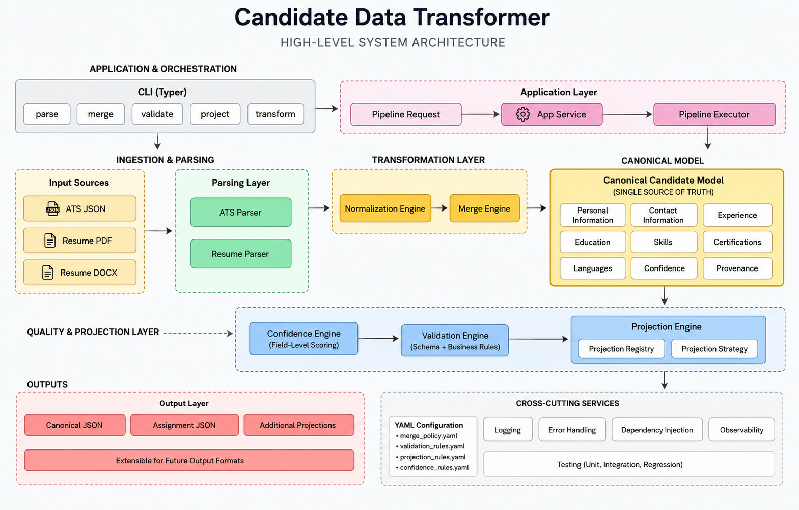

# Candidate Data Transformer


Candidate Data Transformer converts ATS JSON and resume files (PDF/DOCX) into
a single canonical candidate record. It normalizes, merges, scores, and
validates candidate data deterministically, then projects it into one or more
configurable output formats.

The project is structured as a layered Python application: a thin Typer CLI
delegates to an application service, which builds an ordered pipeline of
stateless stages. Each stage wraps an independently testable business engine
(parsing, normalization, merging, confidence scoring, validation, and
projection), all operating on a shared canonical Pydantic model.

It is built to assessment-grade engineering standards — constructor-injected
dependencies, a strict layered dependency direction, configuration-driven
business rules, and a full unit/integration test suite — rather than as a
quick script.

## High-Level System Architecture

<p align="center">

</p>

## Key Features

- **Two input sources** — structured ATS JSON and unstructured resume
  PDF/DOCX, parsed into the same canonical `Candidate` model.
- **Deterministic merging** — per-field merge strategies driven by
  `config/merge_policy.yaml`, with conflicts captured in a `MergeReport`
  rather than silently dropped.
- **Confidence scoring** — explainable, rule-driven scoring (source weight,
  multi-source agreement, conflict penalty, missing-field penalty) with a
  full calculation trace in the output.
- **Schema and business-rule validation** — required fields, format checks
  (email/phone/URL/UUID), duplicate detection, date ordering, and
  confidence-field consistency, all sourced from `config/validation_rules.yaml`.
- **Configurable projection** — `canonical` and `assignment` output formats
  resolved through a `ProjectionRegistry`, with field selection driven by
  `config/projection_rules.yaml`.
- **Strategy-pattern parsers** — `BaseParser` strategy interface; ATS and
  resume parsers are interchangeable behind the same contract.
- **Stateless, declarative pipeline** — the `Pipeline` only executes the
  stage list it is given; `ApplicationService` decides stage order per use
  case, not the pipeline itself.
- **Centralized CLI error handling** — every internal exception type maps to
  a concise, user-facing message; `--debug` reveals full tracebacks.
- **51 automated test modules** spanning unit and integration coverage for
  every engine, the pipeline, and the application/CLI layers.

## Architecture Overview

```
CLI
 ↓
Application Layer
 ↓
Pipeline
 ↓
Transformation Engines
 ↓
Canonical Candidate Model
 ↓
Projection
 ↓
Output
```

- **CLI (`transformer.cli`)** — parses arguments, renders JSON, writes
  output files, and delegates all exception handling to a centralized error
  handler. Contains zero business logic.
- **Application Layer (`transformer.application`)** — the single entry point
  for every use case (`parse`, `merge`, `validate`, `project`, `transform`).
  Builds the `PipelineRequest` and the ordered stage list for the requested
  operation, then invokes the pipeline.
- **Pipeline (`transformer.pipeline`)** — a generic, stateless stage
  executor. It does not decide stage order; it only runs the stages it is
  handed and propagates a mutable `PipelineState` between them, stopping on
  fatal errors and collecting reports/warnings along the way.
- **Transformation Engines** — independently testable, constructor-injected
  components for parsing (`parsers`), normalization (`normalizers`), merging
  (`merge`), confidence scoring (`confidence`), and validation
  (`validation`). Each owns exactly one business responsibility.
- **Canonical Candidate Model (`transformer.models`)** — frozen Pydantic
  models (`Candidate`, `ContactInfo`, `WorkExperience`, `Education`,
  `Certification`, confidence and provenance metadata) shared by every
  engine, ensuring a single source of truth for candidate shape.
- **Projection (`transformer.projection`)** — Strategy-pattern projection
  engine; output shape is resolved by name through a `ProjectionRegistry`
  and driven by YAML field-selection rules rather than hardcoded logic.
- **Output** — rendered as JSON to stdout or written to a file via
  `--output`.

Design principles applied throughout: **Dependency Injection** (every engine
and parser accepts its collaborators via the constructor), a **Stateless
Pipeline** (no instance state carried between runs), **Configuration-Driven**
business rules (merge priority, validation rules, projection fields, skill
aliases all live in `config/*.yaml`, not in code), and the **Strategy
Pattern** (`BaseParser`, `ProjectionStrategy`, and merge/confidence
strategies are all swappable implementations behind a common interface).

## Repository Structure

```
candidate-data-transformer/
├── src/transformer/
│   ├── cli/            # Typer commands + centralized error handler
│   ├── application/    # ApplicationService — single use-case entry point
│   ├── pipeline/        # Stateless stage executor + pipeline stages
│   ├── parsers/         # ATS JSON parser + resume PDF/DOCX parser
│   ├── normalizers/     # Email, phone, string, and skill normalization
│   ├── merge/            # Field-level merge strategies and conflict reporting
│   ├── confidence/      # Explainable confidence scoring engine
│   ├── validation/      # Rule-based validation engine
│   ├── projection/      # Canonical/assignment output projection
│   ├── models/          # Canonical Pydantic candidate model
│   ├── config/          # YAML configuration loaders
│   └── utils/
├── config/               # Runtime YAML configuration (merge, validation, projection, skills)
├── docs/                 # Architecture, design, and API documentation
├── samples/              # Example resume input + expected JSON output
│   ├── resumes/
│   └── expected/
├── tests/
│   ├── unit/             # Per-engine unit tests
│   └── integration/      # Pipeline and application-service integration tests
├── pyproject.toml
└── Makefile
```

## Installation

```bash
# Standard install
pip install .

# Editable install (for development)
pip install -e ".[dev]"
```

Requires Python 3.12+. The installed entry point is `candidate-transformer`
(`transformer` is retained as a backward-compatible alias).

## Quick Start

```bash
# Parse a single ATS JSON or resume file (type detected from extension)
candidate-transformer parse samples/resumes/jane_carter_resume.docx

# Parse, normalize, and merge an ATS record with a resume
candidate-transformer merge ats.json resume.pdf

# Validate an existing canonical candidate JSON file
candidate-transformer validate candidate.json

# Project a canonical candidate into a named output format
candidate-transformer project candidate.json --format assignment

# Run the full pipeline: parse → normalize → merge → confidence → validate → project
candidate-transformer transform ats.json resume.pdf --format canonical
```

Every command supports:

- `--output PATH` / `-o PATH` — write the JSON result to a file instead of stdout.
- `--debug` — print a full traceback on failure (otherwise a concise message is printed to stderr).

A worked example is included in [`samples/`](samples/): run

```bash
candidate-transformer parse samples/resumes/jane_carter_resume.docx
```

and compare the result against
[`samples/expected/jane_carter_resume.expected.json`](samples/expected/jane_carter_resume.expected.json).

## Configuration

Runtime, non-code business rules live under [`config/`](config/):

| File | Purpose |
| --- | --- |
| `confidence_rules.yaml` | Source weights and scoring strategy configuration for the confidence engine |
| `merge_policy.yaml` | Per-field merge strategy and source-priority rules |
| `projection_rules.yaml` | Field selection/renaming for the `assignment` projection |
| `default_output.yaml` | Default projection field set |
| `custom_output.yaml` | Example of an alternate, slimmed-down projection profile |
| `skill_aliases.yaml` | Canonical display-form mapping for skill aliases |
| `validation_rules.yaml` | Schema version bounds consumed by the validation rule registry |

## Documentation

Further documentation lives under [`docs/`](docs/):

- [`docs/index.md`](docs/index.md) — documentation entry point
- [`docs/architecture.md`](docs/architecture.md) — layered architecture and dependency boundaries
- [`docs/pipeline.md`](docs/pipeline.md) — pipeline stage execution model
- [`docs/canonical-model.md`](docs/canonical-model.md) — canonical `Candidate` model reference
- [`docs/cli.md`](docs/cli.md) — full CLI command reference
- [`docs/configuration.md`](docs/configuration.md) — configuration file reference
- [`docs/projection.md`](docs/projection.md) — projection strategy reference
- [`docs/api-reference.md`](docs/api-reference.md) — API/module reference
- [`docs/design-decisions.md`](docs/design-decisions.md) — recorded design decisions
- [`docs/extension-guide.md`](docs/extension-guide.md) — how to add a new parser/projection/rule
- [`docs/01_Software_Requirements_Analysis.md`](docs/01_Software_Requirements_Analysis.md), [`02_Research_Document.md`](docs/02_Research_Document.md), [`03_Technology_Decision_Record.md`](docs/03_Technology_Decision_Record.md), [`04_High_Level_Design.md`](docs/04_High_Level_Design.md) — process/design history

## Testing

The Makefile exposes the project's actual test commands:

```bash
make test              # Run the full test suite
make test-unit         # Unit tests only (tests/unit, marker: unit)
make test-integration  # Integration tests only (tests/integration, marker: integration)
make coverage          # Run tests with terminal + HTML coverage report
```

Equivalently, via pytest directly:

```bash
pytest
```

## Development

The following Makefile targets are available for local code quality checks:

```bash
make lint           # Ruff linting
make lint-fix        # Ruff linting with auto-fix
make format          # Black formatting
make format-check    # Black formatting check (no changes)
make typecheck       # MyPy strict static type checking
make check           # lint + format-check + typecheck
```

See [CONTRIBUTING.md](CONTRIBUTING.md) for contribution guidelines.

## Future Roadmap

The following are potential future enhancements and are **not** implemented
in the current codebase:

- Semantic embeddings for candidate fields
- Candidate similarity search
- Professional profile integration (e.g. LinkedIn)
- Enterprise ATS connectors
- OCR support for scanned/image-only resumes
- REST API surface
- AI-assisted candidate data enrichment

## License

Released under the [MIT License](LICENSE).
