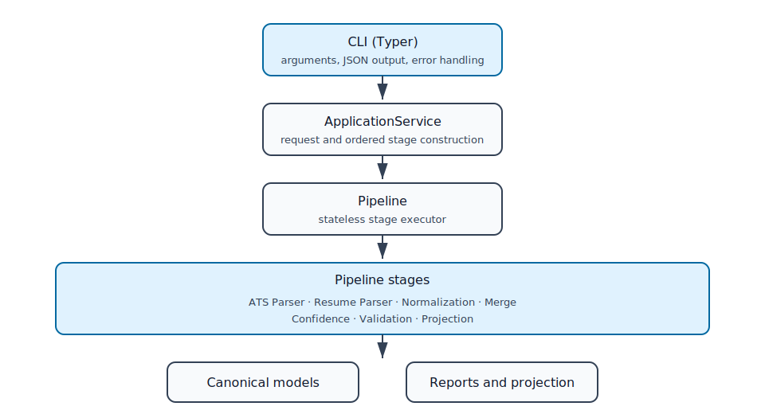

# Architecture

Candidate Data Transformer is a layered Python application. Dependencies point
from delivery and orchestration layers toward existing business engines and
canonical models.

## Layers

1. `transformer.cli` parses command arguments, renders JSON, writes output, and
   translates exceptions.
2. `transformer.application` builds requests and ordered stage lists for each
   use case.
3. `transformer.pipeline` executes supplied stages and propagates mutable state.
4. Parser, normalization, merge, confidence, validation, and projection
   packages own their respective business responsibilities.
5. `transformer.models` contains the canonical Pydantic models shared by the
   engines.

All engines are constructor-injected. The pipeline is stateless between calls,
and `ApplicationService` is the single facade used by the CLI.

## Dependency boundaries

- The CLI does not call business engines directly.
- The pipeline does not select stage order.
- Stages adapt existing engine APIs without moving their logic.
- Confidence consumes the `MergeMetadata` protocol rather than merge internals.
- Projection strategies are resolved through `ProjectionRegistry`.
