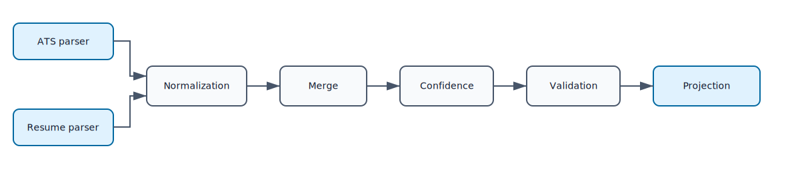

# Pipeline

## Request and state

`PipelineRequest` is immutable and carries ATS, resume, or canonical candidate
paths plus projection/output options. `PipelineState` is mutable and carries
source candidates, the merged candidate, merge metadata, reports, warnings, and
the projected payload.

## Execution

`Pipeline.execute(request, stages, state=None)` runs the supplied stages in
order. It stores each returned report under the stage name and collects report
warnings. Exceptions stop execution and are translated only at the CLI boundary.

Available stages are:

- `ATSParserStage`
- `ResumeParserStage`
- `NormalizationStage`
- `MergeStage`
- `ConfidenceStage`
- `ValidationStage`
- `ProjectionStage`

The application service chooses the sequence. Full transformation parses both
sources once, normalizes both, merges, scores confidence, validates, and
projects. Validation issues produce an unsuccessful `ApplicationResult` rather
than an exception.

The legacy candidate/metadata `run_pipeline` API remains available for existing
confidence and validation integrations.
